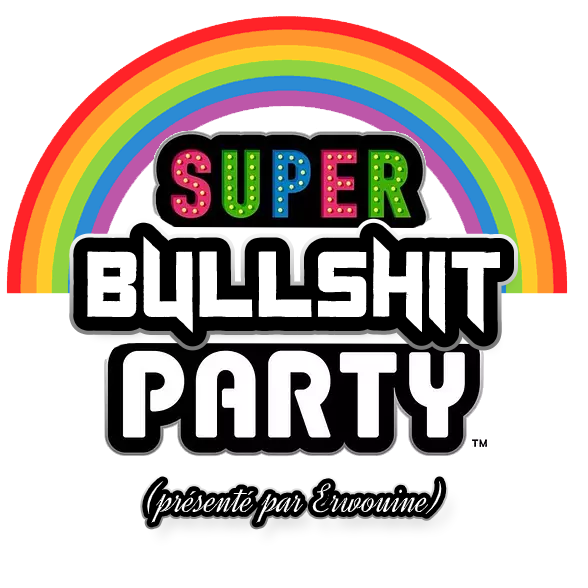
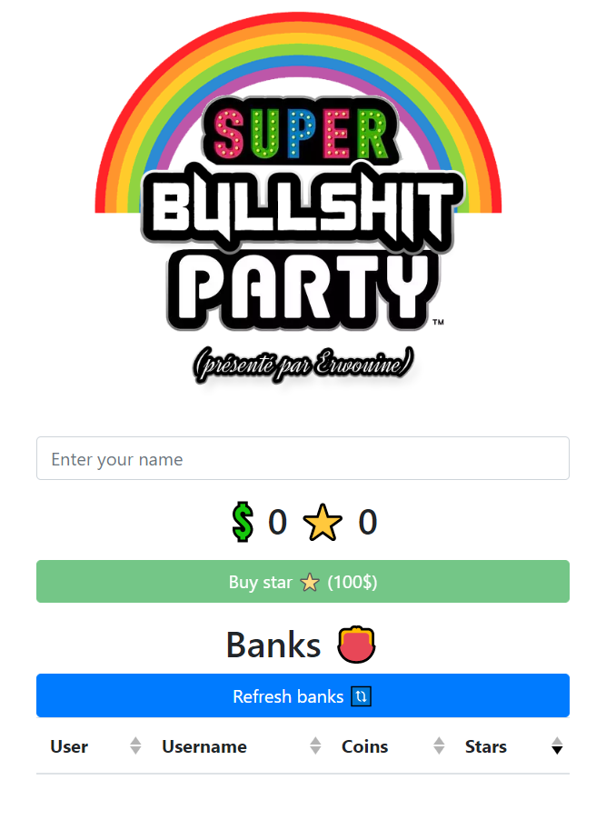
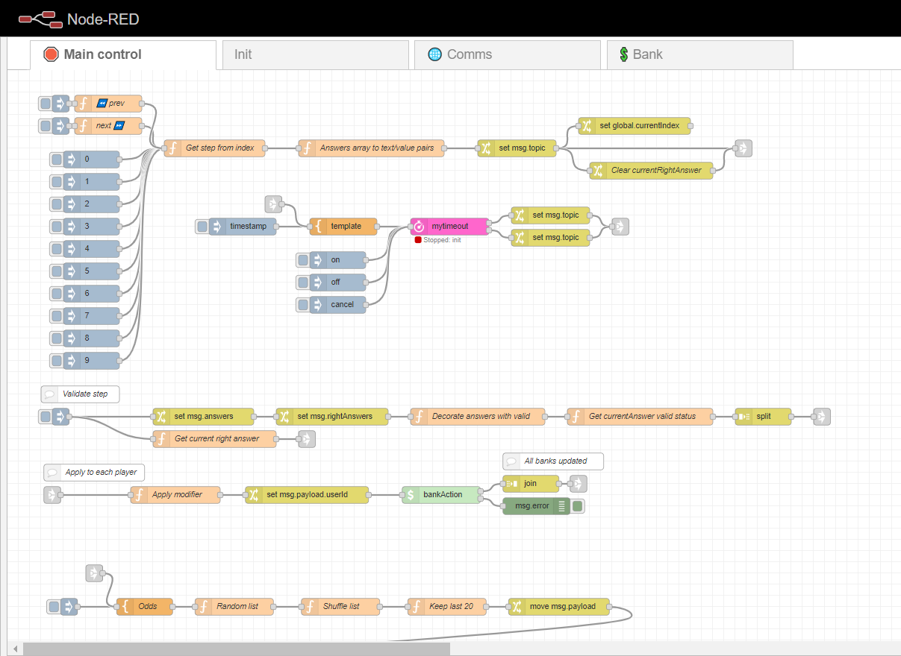

# MPQuiz
## Mario Party style quiz, with powerups and endgame bullshit

### Intent
Make an interactive quiz for a group of friends, with a simple way to add questions.

### Introduction
This project took about a month to create.  
3 weeks of back and forth thinking, trying different techs, hacking stuff together, starting from scratch, etc. See [CONCEPT.md](CONCEPT.md)  
Then I set myself a deadline, and just... did it.   
Node-red, VueJS and a 48h almost-no-sleep weekend later, I present to you: 



### Usage 
```bash
docker-compose up -d
```

http://localhost:1880/quiz  
http://localhost:1880/scoreboard  
http://localhost:1880/admin  

### Overview
The whole quiz can be operated from node-red, and prepared in a single YAML file: [quiz.yml](app/quiz.yml)  
Guests should only access the `/quiz` endpoint, while you can stream `/scoreboard` using OBS, for example.   
Keep in mind this is a very early proof-of-concept, that security is nonexistant (admin is not protected, lots of client-side operation without sanity checks in the back-end, etc.). Use this with a closed group of friends, but don't use this project as-is if you intend to bring some outsiders. It will *definitely* end up with someone hacking everyone else's scores.

#### Guest view


#### Admin view


### License
See [LICENSE](LICENSE)